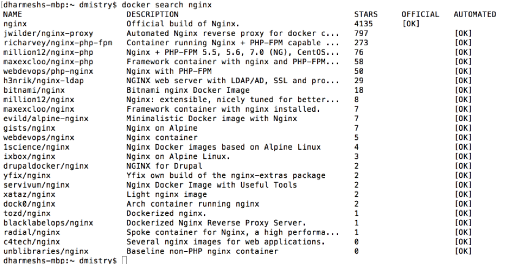
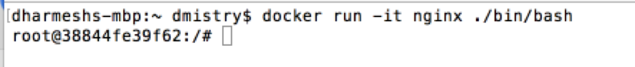
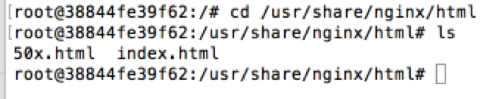
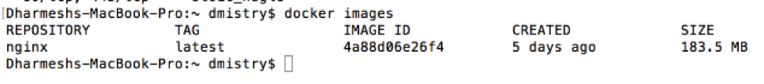
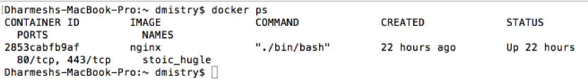
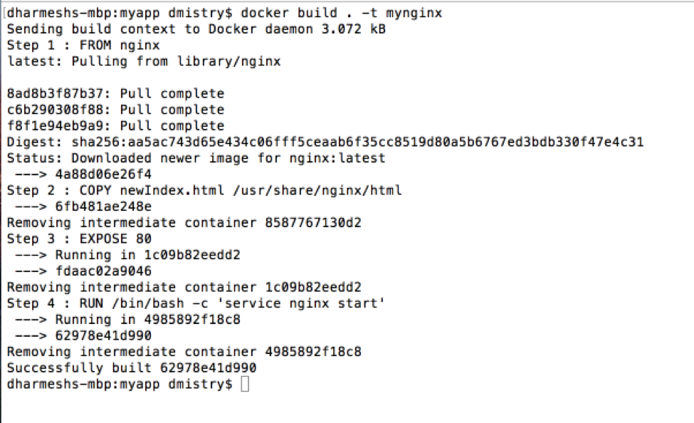
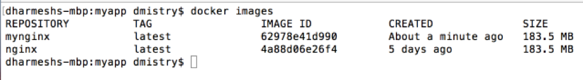
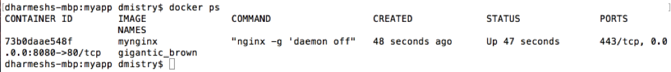

# Basic Docker

## Prerequisites 

In order to complete this lab you will need to have Docker installed on your local machine.  
Your lab machine already has this setup.  However, if you would like to do the lab outside of this session you can download 
and install the [Docker platform](https://www.docker.com/products/overview) yourself.

## Overview 
In this lab you will create a Docker container for a web server and load balancer known as **NGINX**. This container will be 
used in later labs as we build up our microservice solution. This lab will get you familiar with creating an image from
 an existing image, and augmenting it using a Dockerfile so that you can have a repeatable and consistent way to create a container.
  NGINX will be running in a Docker Container and you will access the server from your local machine.

## Table of Contents
1. [Create a Docker Container from Docker Hub](#create-a-docker-container-from-docker-hub)
2. [Explore the Container and Run Common Commands](#explore-the-container-and-run-common-commands)
3. [Create a Docker File to Customize the NGINX Image](#create-a-docker-file-to-customize-the-nginx-image)
4. [Create a Container using the New Image and Validate](#create-a-container-using-the-new-image-and-validate)
5. [Run the NGINX Container and Test from your Local Machine](#run-the-nginx-container-and-test-from-your-local-machine)
6. [Remove Images and Containers](#remove-images-and-containers)
   * [Stop running container](#stop-running-container)
   * [Delete container](#delete-container)
   * [Delete images](#delete-images)
7. [Summary](#summary)


## Create a Docker Container from Docker Hub
The first part of this lab will be to create a Docker container running NGINX within it. A container is a running instance of an image.
You could start with a base image with just an operating system, and install the required software. However, there is a better way 
using a public registry of images known as Docker Hub. We will search Docker Hub for a base image for NGINX 
(a web server/load balancer) and run a container with this image.


1. Open a terminal window on your machine
2. You want to find a suitable image. Do this by searching for the NGINX image on Docker Hub:

    ```bash
    docker search nginx
    ```
    
    You should get back a list of results similar to the image below:
    

2. Find the image you want to use, in our case the official build, and run the image in a container:

    ```bash
    docker run -it nginx ./bin/bash
    ```

    In the above command:
    * *docker run* – creates and runs a container
    * *nginx* – is the image you want to run
    * *-t* – flag to assign a terminal inside the newly created container
    * *-i* – flag that allows you to make an interactive connection by getting the standard in of the container
    * */bin/bash* – launches a Bash shell inside the container

    Your terminal window is now running a bash shell inside the NGINX container you created. 
    You will see that your shell prompt has changed from your local machine to the container, and 
    logged in as root. In the example below you are now logged in as root on the host *38844fe39f62*

    

3. The first thing we will want to do is examine the file system of the container you have shelled into. 
Change to the nginx html directory and have a look at the files that are there. 
We will be adding a new file here later, so it is good to see what is there right now.

    ```bash
    cd /usr/share/nginx/html
    ls
    ```
    You should see the following files:

    

> **What does the Docker run command do?**
>
> It is helpful to understand what the docker run command is actually doing.
>
> Reference: [https://docs.docker.com/engine/understanding-docker/](https://docs.docker.com/engine/understanding-docker/)
>
> *In order, Docker Engine does the following when you execute docker run:*
> * **Pulls the nginx image:** Docker Engine checks for the presence of the nginx image. If the image already 
exists, then Docker Engine uses it for the new container. If it doesn’t exist locally on the host, 
then Docker Engine pulls it from [Docker Hub](https://hub.docker.com).
> * **Creates a new container:** Once Docker Engine has the image, it uses it to create a container.
> * Allocates a filesystem and mounts a read-write layer: The container is created in the file system and a 
read-write layer is added to the image.
> * **Allocates a network / bridge interface:** Creates a network interface that allows the Docker container
 to talk to the local host.
> * **Sets up an IP address:** Finds and attaches an available IP address from a pool.
> * **Executes a process that you specify:** Runs your application (in our case we asked for the /bin/bash 
script to be run), and;
> * **Captures and provides application output:** Connects and logs standard input, outputs and errors for
 you to see how your application is running.

## Explore the Container and Run Common Commands

In this section we will keep our container running and run some basic CLI commands to explore what has 
just been done in the previous section.

1. Open a new terminal window and leave the first terminal window running
2. Run the CLI command to see a list of images you have on your machine.  You will see that your 
local machine has the nginx Docker image that was pulled from Docker Hub via the run command above
 and cached on your local machine (NOTE: you will see other images as well as we cached other images to save time during the labs):

    ```bash
    docker images
    ```
    

3. In the new terminal window, run the CLI command to see a list of running containers on your machine.
    ```bash
    docker ps
    ```

    You should see something similar to the following that shows your container running.  Make note of the 
    container name for use later (e.g. stoic_hugle)

    

4. Return to the first terminal window where you have shelled into the container. You can now stop the container
 by typing exit. Verify the container is stopped by running *docker ps*

> **Why do Containers have funny names?**
>
>The Docker daemon generates a random string if you do not give your container a name using the 
--name flag with the Docker run command.

## Create a Docker File to Customize the NGINX Image
So far, we have taken an image (NGINX) from Docker Hub, pulled it onto our machine and created a container
 from the image.  We then explored the files in the Container and learned some basic CLI commands.

Now, we will take this a step further and customize the image in a repeatable manner by building an image
 using instructions from a Dockerfile.  "A Dockerfile is a text document that contains all the commands a user 
 could call on the command line to assemble an image."[ref 1](https://docs.docker.com/engine/reference/builder/)

"The Docker daemon runs the instructions in the Dockerfile one-by-one, committing the result of each 
instruction to a new image if necessary, before finally outputting the ID of your new image. The Docker daemon
 will automatically clean up the context you sent.  Whenever possible, Docker will re-use the intermediate 
 images(cache), to accelerate the Docker build process significantly." [ref 2](https://docs.docker.com/engine/reference/builder/)

1. Open a terminal window and create a directory on your local machine (e.g. mycontainer)
2. Change to the directory you created  ```bash cd mycontainer```
2. In the directory create an HTML file called _newIndex.html_, with the following content:
    ```html
    <!DOCTYPE html>
    <html>
      <head><title>My New HTML Page</title></head>
        <body>
          <h1> Welcome to a new HTML Page</h1>
          <p> This was a new file that you had on your local host machine and was copied to the nginx 
          container through the Dockerfile </p>
        </body>
    </html>
    ```

3. In the same directory create a file called ```Dockerfile```, open the file in an editor, and paste in the 
content below.  This Dockerfile contains instructions to build an image from the nginx image on DockerHub, 
copy your HTML file to the image, expose port 80 and then start NGINX.

    ```dockerfile
    # identify the image from which we want to create our new image
    FROM nginx

    # copy a new HTML file from your local machine to the container under /usr/share/nginx
    COPY newIndex.html /usr/share/nginx/html 

    #Expose port 80 of the container
    EXPOSE 80

    # start nginx server
    RUN /bin/bash -c 'service nginx start'
    ```

4. Next, run the Docker build command to build an image from the Dockerfile you specified and tag the image mynginx.

    ```bash
    docker build . –t mynginx
    ```

    This command tells docker to build from the current directory and tagging the image as mynginx

5. Verify that your image was created successfully by examining the logs that appear.  You 
can see each step of the Dockerfile being executed.  The log should look similar to the following:

    

6. Run the docker images command to see a list of the images you created.  You should see an image for 
nginx and mynginx.  The nginx image was pulled from DockerHub and cached locally as part of your Dockerfile 
instructions:

    ```bash
    docker images
    ```
    

    NOTE: Your local lab machine may have more images, verify that mynginx and nginx are there.

What you have now is a Docker image on your local machine that has the nginx image from Docker Hub, 
along with a new file added to the html directory, and the command to start the server.

## Create a Container using the New Image and Validate

Now that you have built an image using the Dockerfile you can create a container and verify that your new
 file was copied over and that NGINX was started as per the Dockerfile.

1.	Create a container from the newly created image and shell into the container

    ```bash
    docker run –it mynginx /bin/bash
    ```

2. Change to the web server root directory and list files
    ```bash
    cd /usr/share/nginx/html
    ls
    ```

3. You should see your __*newIndex.html*__, along with the default files that nginx already had.
4. Exit from the container

## Run the NGINX Container and Test from your Local Machine

Now that you have created an image using your Dockerfile, you can go ahead and create a running 
container from the image

1. Run Docker command to create container and map your ports:

    ```bash
    docker run –d –p 8080:80 mynginx
    ```

> * The docker run command is taking the mynginx image and creating a container.  
> * The -d flag tells the run command to run this in a detached mode.  This means when the containers exit when the root process used to run the container exits
> * -p 8080:80 maps port 8080 on your local machine to port 80 in the container

2. You will see a string of characters return, this is your CONTAINER ID.  Run the Docker ps command to 
see that your container started successfully

    ```bash
    docker ps
    ```
    
    You will see a listing similar to what you see below:
    

3. Now you can test that NGINX is running from your local machine by accessing
 [http://localhost:8080/](http://localhost:8080/) where you will see the NGINX welcome page.

4. Next test that your new HTML file also loads by going to 
[http://localhost:8080/newIndex.html]http://localhost:8080/newIndex.html where you will see the new 
HTML page that you created.

## Remove Images and Containers

Now that we have validated the container we can run some common commands to remove containers and images.

### Stop running container

1.  Get your contianer's ID by listing running containers
    ```bash 
    docker ps
    ```
2.  Use the first four characters of your CONTAINER ID to stop the container
    ```bash 
    docker stop <first four characters of your container ID>
    ```
3.  Run docker ps again and you should no longer see the container running

### Delete container

Once a container is stopped it will still exist on your system and can be restarted at a later time.  Let's go ahead
and delete this container since we are done with it.

1.  Find all containers on your system.  The  ```-a``` flag will show all containers, not just running containers.  
You will get a list of containers listed out similar to the screenshot below.
    ```bash
    docker ps -a
    ```

2.  Find the container you want to delete and make note of the first 4 characters of its CONTAINER ID.  You can now 
delete the container with the following command.

    ```bash
    docker rm <first 4 characters of CONTAINER ID>
    ```    

3. Run the ```docker ps -a``` command again and confirm the container is now deleted.

### Delete images

1.  Get a list of images on your machine

    ```bash 
    docker images
    ```

    

2.  Find the image you want to delete (i.e. mynginx), make note of the IMAGE ID, and run the docker command to delete images:

    ```bash
    docker rmi <IMAGE ID>
    docker images
    ```
    > NOTE: You may get an error deleting the image if there are any containers remaining that reference the image.  You will see 
    > an error similar to the one below.  If you encounter that error you will need to go back an delete any containers that reference
    > this image.
    >
    > _"Error response from daemon: conflict: unable to remove repository reference "mynginx" (must 
    > force) - container 73b0daae548f is using its referenced image 62978e41d990"_


## Summary

You have now completed the basic Docker lab.  Let's recap what you learned in this lab exercise:

* You created a Docker container of a web server (NGINX) from an image on a public registry (e.g. Docker Hub)
* You explored the NGINX container you created from the Docker Hub image
* You created your own NGINX image using Dockerfile that allowed you to customize the base NGINX image with repeatable instructions
* You created a container from the custom image you built using a Dockerfile
* You accessed from your local machine the webserver running in a container, and saw your customizations 
* You learned basic docker commands to list, and delete images and containers.
