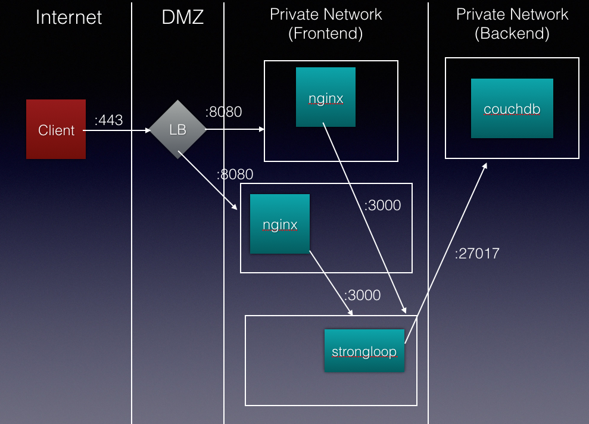
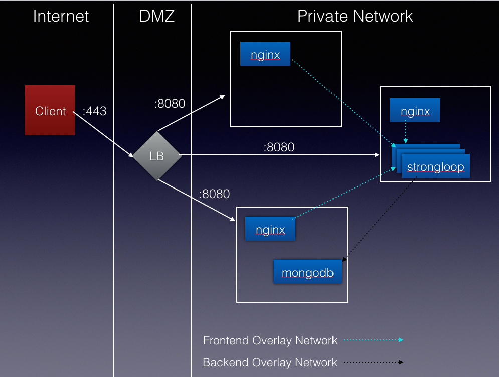

# Overview
In order to scale your application workloads for production needs, you need to select an orchestration framework.  There are a number of popular container orchestration frameworks available today (e.g. [Kubernetes](http://kubernetes.io/), [DCOS/Mesos](https://dcos.io/) and [Docker Swarm](https://docs.docker.com/engine/swarm/)).  This tutorial will help you setup Docker Swarm.

[Watch on YouTube](https://www.youtube.com/watch?v=8c_hQZEx3VA&list=PLKWiGyDcaq_ZT_dYqneTxsc5OglDrj_ap&index=1)


## Prerequisites
1. Install [Docker Toolbox](https://www.docker.com/products/docker-toolbox).  We leverage Docker Machine in the scripts to provision Docker 1.12+ on Virtual Box Linux VMs.  You could just install Docker Engine directly if you are on [Linux](https://docs.docker.com/engine/installation/).
1. Have a [Docker Hub](https://hub.docker.com/) account

## Table of Contents
1. [Step 1 - Setup Docker Swarm](#step-1-setup-docker-swarm)
2. [Step 2 - Setup shared storage between VMs](#step-2-setup-shared-storage-between-vms)
    * [Step. 2.1 - Test the volume setup](#step-21-test-the-volume-setup)
3. [Step 3 - Build Docker Images](#step-3-build-docker-images)
4. [Step 4 - Run the ELK stack](#step-4-run-the-elk-stack)
5. [Step 5 - Run the app](#step-5--run-the-app)
    * [Traditional Stack](#traditional-stack)
    * [Swarm Stack](#swarm-stack)
6. [Step 6 - Demo Ops](#step-6-demo-ops)

## Step 1 Setup Docker Swarm
[Watch on YouTube](https://www.youtube.com/watch?v=xKtNXR6mzSU&index=1&list=PLKWiGyDcaq_ZT_dYqneTxsc5OglDrj_ap)

1. Use docker-machine to provision Docker engine on three nodes (i.e. vms).
    
    ```
    docker-machine create -d virtualbox manager-1
    docker-machine create -d virtualbox worker-1
    docker-machine create -d virtualbox worker-2
    ```
1. Now take a look at the list of machines that are catalogued
    
    ```
    docker-machine ls --filter=driver=virtualbox
    ```
1. (Optional) Target the manager node, and start a simple [swarm visualizer](https://github.com/ManoMarks/docker-swarm-visualizer).  And then go to `http://$(docker-machine ip manager-1):5000` to see the visualizer.

    ```
    eval $(docker-machine env manager-1)
    docker run -it -d -p 5000:8080 -v /var/run/docker.sock:/var/run/docker.sock manomarks/visualizer
    open http://$(docker-machine ip manager-1):5000
    ```
1. Target the manager-1, and make it a swarm manager. Take note of the command to join nodes to the swarm.  You will use this in the next step.

    ```
    eval $(docker-machine env manager-1)
    docker swarm init --advertise-addr $(docker-machine ip manager-1)
    ```

1. Join the worker nodes to the swarm.  To do this, target each machine in order, and issue the docker swarm join command that was output by the last step.

    ```
    eval $(docker-machine env worker-1)
    eval $(docker-machine env worker-2)
    ```

1. Target a manager node again, and view all of the nodes in the swarm.

    ```
    eval $(docker-machine env manager-1)
    docker node ls
    ```

1. A simple 3 node swarm is now setup.  The above steps were adapted from [Getting started with swarm mode](https://docs.docker.com/engine/swarm/swarm-tutorial/).  You can view details of your swarm with the following:

    ```
    eval $(docker-machine env manager-1)
    docker info
    ```
    
## Step 2 Setup shared storage between VMs
The Swarm will distrubute containers amongst VMs wherever there are resources available.  You can constrain where certain containers are run, but to have a truly scalable system, you should try to avoid that.  This means that containers that save state, need to mount volumes from a shared storage.  You could use NFS or some other block storage for this.  Docker provides a `volume driver` plugin framework.  Many third party storage providers are creating drivers.  In this tutorial, we will use EMC's [REX-Ray](http://rexray.readthedocs.io/en/stable/), since it works well with virtualbox.

[Watch on YouTube](https://www.youtube.com/watch?v=tE4wHXY3LxM&list=PLKWiGyDcaq_ZT_dYqneTxsc5OglDrj_ap&index=2)

1. Make sure that Virtualbox authentication is disabled to make the demo easier to complete, and start the HTTP SOAP API.

    ```
    VBoxManage setproperty websrvauthlibrary null && vboxwebsrv --background
    export REXRAY_SERVER=$(docker-machine ip manager-1)
    export HOST_VOLUME_PATH=${PWD}/volumes
    ```
    
1. Install the REX-ray server on `manager-1`.  The versions are VERY IMPORTANT.  Unfortunately the project is still not 1.0 release, so the metadata format of the config file changes a lot amongst releases.

    ```
    docker-machine ssh manager-1 "curl -sSL https://dl.bintray.com/emccode/rexray/install | sh -s -- stable 0.5.1"
    docker-machine ssh manager-1 \
    "wget http://tinycorelinux.net/6.x/x86_64/tcz/udev-extra.tcz \
    && tce-load -i udev-extra.tcz && sudo udevadm trigger"
    docker-machine ssh manager-1 "sudo rexray service stop"
    docker-machine ssh manager-1 "sudo rm /etc/rexray/config.yml"
    
    docker-machine ssh manager-1 \
    "sudo tee -a /etc/rexray/config.yml << EOF
    rexray:
      logLevel: warn
    libstorage:
      host:     tcp://${REXRAY_SERVER}:7979
      embedded: true
      service:  virtualbox
      server:
        endpoints:
          public:
            address: tcp://${REXRAY_SERVER}:7979
        services:
          virtualbox:
            driver: virtualbox
    virtualbox:
      volumePath: ${HOST_VOLUME_PATH}
    "
    
    docker-machine ssh manager-1 "sudo rexray service start"
    docker-machine ssh manager-1 "docker volume ls"
    ```
    
1. Install the REX-ray client on worker-1

    ```
    docker-machine ssh worker-1 \
    "curl -sSL https://dl.bintray.com/emccode/rexray/install | sh -s -- stable 0.5.1"
    docker-machine ssh worker-1 \
    "wget http://tinycorelinux.net/6.x/x86_64/tcz/udev-extra.tcz \
    && tce-load -i udev-extra.tcz && sudo udevadm trigger"
    docker-machine ssh worker-1 "sudo rexray service stop"
    docker-machine ssh worker-1 "sudo rm /etc/rexray/config.yml"
    
    docker-machine ssh worker-1 \
    "sudo tee -a /etc/rexray/config.yml << EOF
    rexray:
      logLevel: warn
    libstorage:
      host:    tcp://${REXRAY_SERVER}:7979
      service: virtualbox
    "
    
    docker-machine ssh worker-1 "sudo rexray service start"
    docker-machine ssh worker-1 "docker volume ls"
    ```
    
1. Install the REX-ray client on worker-2

    ```
    docker-machine ssh worker-2 \
    "curl -sSL https://dl.bintray.com/emccode/rexray/install | sh -s -- stable 0.5.1"
    docker-machine ssh worker-2 \
    "wget http://tinycorelinux.net/6.x/x86_64/tcz/udev-extra.tcz \
    && tce-load -i udev-extra.tcz && sudo udevadm trigger"
    docker-machine ssh worker-2 "sudo rexray service stop"
    docker-machine ssh worker-2 "sudo rm /etc/rexray/config.yml"
    
    docker-machine ssh worker-2 \
    "sudo tee -a /etc/rexray/config.yml << EOF
    rexray:
      logLevel: warn
    libstorage:
      host:    tcp://${REXRAY_SERVER}:7979
      service: virtualbox
    "
    
    docker-machine ssh worker-2 "sudo rexray service start"
    docker-machine ssh worker-2 "docker volume ls"
    ```

### Step 2.1 Test the volume setup
Now test that shared storage works by creating a volume on worker-1 and validating that it is visible on worker-2.

1. Create a sample volume called `hellopersistence` and run a simple `busybox` container mounting that volume. Let's do this first with a standalone container.

    ```
    eval $(docker-machine env worker-1)
    docker volume rm hellopersistence
    docker volume create --driver rexray --opt size=1 --name hellopersistence
    docker run -tid --volume-driver=rexray -v hellopersistence:/mystore --name temp01 busybox
    docker exec temp01 touch /mystore/myfile
    ```

1. You should see myfile listed in the container volume.  Then we can remove the container (the volume will persist).

    ```
    docker exec temp01 ls /mystore
    docker rm -f temp01
    ```
    
1. Now target worker-2, and startup a new container there.  We mount the same named volume into the new container, and you should see the same `myfile` listed.

    ```
    eval $(docker-machine env worker-2)
    docker run -tid --volume-driver=rexray -v hellopersistence:/mystore --name temp01 busybox
    docker exec temp01 ls /mystore
    docker rm -f temp01
    ```
    
1.  Now we will test with a Docker 1.12+ service, instead of a standalone container.  Remember to target a manager node when deploying services.  Wait for the service to start.

    ```
    eval $(docker-machine env manager-1)
    docker service create --replicas 1 \
    --name nginx \
    -p 8080:80 \
    --mount type=volume,source=hellopersistence,target=/usr/share/nginx/html,volume-driver=rexray \
    nginx
    
    docker service ls
    docker service inspect --pretty nginx
    docker service ps nginx //You will see what node nginx is running on, and then you can go to that node
    //Once on the node, docker exec <containerid> ls /usr/share/nginx/html and you should see myfile
    docker service rm nginx
    ```
    
1. Finally remove the volume

    ```
    docker volume rm hellopersistence
    ```

## Step 3 Build Docker Images
We will build and push images to Docker Hub.  Don't forget to log into Docker Hub, and also to change the image names.  That is, you will not have permission to push images to `cascon/*` organization. NOTE: Make sure you are in the `part-3` directory before running the commands below.

[Watch on YouTube](https://www.youtube.com/watch?v=6vONa3OBTmY&list=PLKWiGyDcaq_ZT_dYqneTxsc5OglDrj_ap&index=3)

1. Log into Docker Hub

    ```
    eval $(docker-machine env manager-1)
    docker login
    ```
1. Build and push the database (mongodb), static web server (nginx) and REST backend (strongloop) from part 2.

    ```
    docker build --rm -t cascon/db ../part-2/db
    docker push cascon/db
    docker build --rm -t cascon/gateway ../part-2/gateway
    docker push cascon/gateway
    docker build --rm -t cascon/strongloop ../part-2/strongloop
    docker push cascon/strongloop
    ```
    
1. Later in the turorial we will deploy centralized logging using the [ELK stack](https://www.elastic.co/videos/introduction-to-the-elk-stack).  Let's build and push those images as well.

    ```
    docker build --rm -t cascon/elk-elasticsearch ./elk/elasticsearch
    docker push cascon/elk-elasticsearch
    docker build --rm -t cascon/elk-logstash ./elk/logstash
    docker push cascon/elk-logstash
    docker build --rm -t cascon/elk-kibana ./elk/kibana
    docker push cascon/elk-kibana
    ```
 
## Step 4 Run the ELK stack
The ELK stack will be used to provide centralized log collection for our containers.

[Watch on YouTube](https://www.youtube.com/watch?v=exYiTAJah4E&list=PLKWiGyDcaq_ZT_dYqneTxsc5OglDrj_ap&index=4)

1. First create the docker volumes and networks for the ELK stack

    ```
    eval $(docker-machine env manager-1)
    docker network create \
    --driver overlay \
    logging

    docker volume create --driver rexray --opt size=7 --name esdata
    ```

1. Target the swarm manager to deploy the ELK stack (Elasticsearch, logstash and Kibana).

    ```
    eval $(docker-machine env manager-1)
    docker service create \
    --name elasticsearch \
    --replicas 1 \
    --network logging \
    -e LOGSPOUT=ignore \
    --mount type=volume,source=esdata,target=/usr/share/elasticsearch/data,volume-driver=rexray \
    cascon/elk-elasticsearch:latest
    
    docker service create \
    --name logstash \
    --replicas 1 \
    --network logging \
    -e LOGSPOUT=ignore \
    -p 12201:12201/udp \
    cascon/elk-logstash:latest logstash -f /opt/logstash/conf.d/logstash.conf
    
    docker service create \
    --name kibana \
    --replicas 1 \
    --network logging \
    -e LOGSPOUT=ignore \
    -p 5601:5601 \
    cascon/elk-kibana:latest
    ```
    
1. Test that Kibana is running by going to port 5601 on any swarm node.  There is no data in Elastic search yet, so we will come back to Kibana to create an index after the app starts up in the next step.

    ```
    open http://$(docker-machine ip manager-1):5601
    ```

## Step 5 Run the app
In this step, we will run the application you built in part 2.  This time though, we will run each container we defined in the Docker compose file, as a Docker 1.12+ service.  Services in Docker allow us to easily define scalable micro services that are highly available.  To learn more, I would recommend this [tutorial](https://docs.docker.com/engine/swarm/swarm-tutorial/) and this [video](https://www.youtube.com/watch?v=KC4Ad1DS8xU&). 

[Watch on YouTube](https://www.youtube.com/watch?v=1s4ppXHZbDo&list=PLKWiGyDcaq_ZT_dYqneTxsc5OglDrj_ap&index=5)

### Traditional Stack
Now you have to scale app services with traditional means.  You get less utilization of VMs.


### Swarm Stack
Swarm scales your services as containers on any node.  You get better utilization of VMs.  You also get to take advantage of overlay networking to segregate containers. NOTE: The layout of containers below is just an example.  The swarm decides where to best place containers.  


1. Create overlay networks for frontend and backend services.

    ```
    eval $(docker-machine env manager-1)
    docker network create \
    --driver overlay \
    frontend

    docker network create \
    --driver overlay \
    backend
    ```
    
1. Create named Docker volumes by taking advantage of the libStorage driver that REX-ray provides (see step 2 above)

    ```
    docker volume create --driver rexray --opt size=7 --name dbdata
    docker volume ls
    ```

1. Create the db service, and connect it to the `backend` overlay network.  Note the `--mount type=volume,source=dbdata,target=/data/db,volume-driver=rexray` that mounts the named docker volume we created above.  This makes sure that if the db container dies, or needs to be created on another node, that its data is not lost.  Wait for the db to start up before running the next step (i.e. starting the api). 

    ```
    docker service create \
     --name db \
     --network backend \
     --network logging \
     --replicas 1 \
     -e MONGODB_USER=dba \
     -e MONGODB_DATABASE=mycars \
     -e MONGODB_PASS=dbpass \
     --log-driver=gelf --log-opt gelf-address=udp://$(docker-machine ip manager-1):12201 \
     --mount type=volume,source=dbdata,target=/data/db,volume-driver=rexray \
     cascon/db:latest
    ```
    
1. (Optional) If you had a previous volume mounted to the container, you may get an `old lock file` error.  You can try and fix this by issuing the following commands in the running container.


    ```
    docker service rm db
    docker run -it --volume-driver=rexray -v dbdata:/data/db cascon/db:latest bash
    mongod --repair --dbpath /data/db
    exit
    
    docker service create \
     --name db \
     --network backend \
     --network logging \
     --replicas 1 \
     -e MONGODB_USER=dba \
     -e MONGODB_DATABASE=mycars \
     -e MONGODB_PASS=dbpass \
     --log-driver=gelf --log-opt gelf-address=udp://$(docker-machine ip manager-1):12201 \
     --mount type=volume,source=dbdata,target=/data/db,volume-driver=rexray \
     cascon/db:latest
    ```
    
1. Now that the db has started up, you can go back to Kibana to create an index.  Select the timestamp field as `@timestamp` and click the `create` button.  Now click the `Discover` tab at the top left of the UI.  You should see logs from mongodb!

1. Create the api service, and connect it to the backend and frontend overlay networks.  Note the `--log-driver=gelf --log-opt gelf-address=udp://$(docker-machine ip manager-1):12201`.  This tells the container to use Docker's built in log driver for gelf.  The gelf format of log messages is one that logstash understands, and can be consumed by the ELK stack as such.

    ```
    docker service create \
    --name api \
    --network backend \
    --network frontend \
    --network logging \
    --replicas 1 \
    -e NODE_ENV=production \
    --log-driver=gelf --log-opt gelf-address=udp://$(docker-machine ip manager-1):12201 \
    cascon/strongloop:latest
    ```
    
1. Create the nginx gateway to strongloop and expose ingress 8080.  8080 will be ingress on every node in the swarm.  This allows an external load balancer to spray traffic to any node in the swarm, and still reach nginx.

    ```
    docker service create \
    --name gateway \
    --network frontend \
    --network logging \
    --replicas 1 \
    --log-driver=gelf --log-opt gelf-address=udp://$(docker-machine ip manager-1):12201 \
    -p 8080:80 \
    cascon/gateway:latest
    ```
    
1. You can now go to any Swarm node on port 8080, and view the Strongloop explorer API.  

    ```
    open http://$(docker-machine ip worker-1):8080/explorer
    ```
    
1. Make some REST POST calls to update data in the database. 
    
## Step 6 Demo Ops
[Watch on YouTube](https://www.youtube.com/watch?v=Lbyl8lmmLJ0&index=6&list=PLKWiGyDcaq_ZT_dYqneTxsc5OglDrj_ap)

1. Scale nginx to take on more load.

    ```
    docker service scale gateway=3
    ```
    
1. Drain the node that has the api.  This will force the api to be scheduled on another active node.

    ```
    docker node update --availability drain <node>
    ```

1. After the node is drained, we should see that the api may need a reboot (i.e. cached connection).  Since there is no docker service restart yet.  Here is a hack to force a restart.

    ```
    docker service update --env-add UPDATE=1 api
    ```

1. Now validate that the data is still there from step 5.  Again go to `http://$(docker-machine ip worker-1):8080/explorer`

1. Let's stop nginx and make sure we have exactly one instance on every node in the cluster with the `global` mode option.

    ```
    docker service rm gateway
    
    docker service create \
    --name gateway \
    --network frontend \
    --network logging \
    --log-driver=gelf --log-opt gelf-address=udp://$(docker-machine ip manager-1):12201 \
    -p 8080:80 \
    --mode global \
    cascon/gateway:latest
    ```


